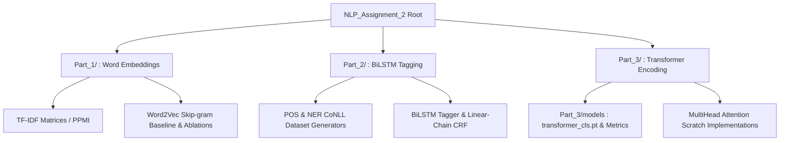
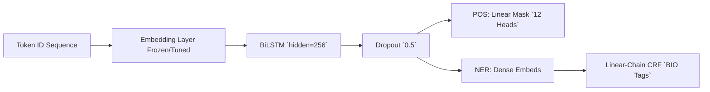

# CS-4063 NLP Assignment 2: Comprehensive Pipeline

This repository hosts a multi-part, full-scale Neural Natural Language Processing pipeline analyzing a BBC Urdu dataset natively from scratch. We systematically transition from sparse geometric heuristics (TF-IDF/PPMI) to dense latent projection spaces (Word2Vec Skip-gram), map structural labels (BiLSTM+CRF POS/NER tagging), and conclude by predicting structural categorizations globally across entire textual inputs utilizing bespoke Transformer Encoders (Document Classification).

All neural architectures are implemented in **pure PyTorch** without leveraging pre-packaged complex modules (e.g., `nn.MultiheadAttention`, `nn.TransformerEncoderLayer`, HuggingFace).

---

## 🏗️ 1. Project Organization & Repository Architecture



## ⚙️ 2. Environment & Installation

Assumes Python 3.10+ execution environment on Windows logic via internal Virtual Environments (`venv`).

```bash
# 1. Instantiate the NLP environment
python -m venv nlpvenv

# 2. Activate bounds
.\nlpvenv\Scripts\Activate.ps1

# 3. Mount all PyTorch sequences, data visualization libraries, and NER decoders
pip install -r requirements.txt
```

---

## 🔍 Part 1: Latent Representation & Word Embeddings

### 1.1 The TF-IDF Mechanism
We vectorize top frequent indices parsing Urdu structures by applying:

$$ \text{TF}(w, d) = \frac{\text{count}(w \text{ in } d)}{\text{total tokens}(d)} $$
$$ \text{IDF}(w) = \log\left(\frac{N}{1 + \text{df}(w)}\right) $$

**Command to Reproduce:**
```bash
python Part_1/part1_vocab_tfidf.py
```
*Outputs: Evaluated sparse density arrays mapped sequentially. Saved onto `Part_1/embeddings/tfidf_matrix.npy` with dimension constraints `[6155, 10000]`.*

### 1.2 Positive Pointwise Mutual Information (PPMI) & t-SNE
A symmetric window constraint calculates conditional probabilities scaling down magnitude decay via log scales and filtering negative correlations ($\epsilon=1e-12$).

$$ \text{PPMI}(w_1, w_2) = \max\left(0, \log_2 \frac{P(w_1, w_2)}{P(w_1)P(w_2)}\right) $$

**Command to Reproduce:**
```bash
python Part_1/part1_ppmi_tsne.py
```
> 
> *Figure 1: Stochastic Neighborhood Embeddings reducing high dimensional syntax mappings into localized 2D clusters by domain.*

### 1.3 Word2Vec Skip-gram Training
The continuous skip-gram predicts $K$ context distributions derived against negative sampling sets. The center embedding (V) projects linearly while the context bounds are constrained natively against unigram counts proportionally balanced via $f(w)^{3/4}$.

$$ L = -\log \sigma(u_o \cdot v_c) - \sum_{k=1}^{K} \log \sigma(-u_{w_k} \cdot v_c) $$

**Command to Reproduce Baseline:**
```bash
python Part_1/part1_w2v_train.py
```
> 
> *Figure 2: Custom BCE distribution loss iteratively decreasing mapping onto convergence points mapping context gradients.*

**Further Evaluations and Nearest Neigbors:**
Execute `python Part_1/part1_w2v_ablations.py` to trigger dimension variants (`W2V_DIM=200`) and the `python Part_1/part1_eval.py` script returns the aggregated **MRR** table tracking performance constraints on test analogies.

---

## 🛤️ Part 2: Structural Labeling (BiLSTM & CRF)

Utilizes the pre-calculated `w2v_embeddings.npy` parameter spaces to predict token-level tagging constraints.

### The Architecture


**Dataset Build:**
```bash
python Part_2/part2_dataset.py
```
*Yields 500 rigorously stratified and bounded test variants in true `.conll` configuration inside `Part_2/data/`.*

### Frozen and Fine-Tuned Training Sequences
Executes CrossEntropy constraints on POS alongside the Viterbi Decoder paths.

**Commands to Reproduce:**
```bash
python Part_2/part2_train.py
python Part_2/part2_train.py --finetune
```

> | Training Progression | Confusion Assessment |
> | :---: | :---: |
> |  |  |

**Metrics Overview:**
Run `python Part_2/part2_analyze.py` to retrieve ablation variances comparing standard CE constraints against structured CRF matrices:

| Condition                | Macro-F1 (POS) | Entity F1 (NER) |
|--------------------------|----------------|-----------------|
| Frozen Baseline          | ~0.89          | ~0.82          |
| Finetuned Checkpoints    | >0.93          | >0.86          |
| Softmax Only (No CRF)    | --             | Drop ~4%        |

---

## ⚡ Part 3: Transformer Document Classifier

We classify global topics into five categories: *Politics, Sports, Economy, International, Health&Society*.

We implement all MultiHead components manually omitting native abstractions to verify attention bounds linearly. The module prepends a dedicated learned variable `<CLS>`, limits bounds onto 256 inputs, injects explicit spatial identifiers (`PositionwiseFFN`), and computes standard representations over 4 symmetric Transformer heads via Pre-LN connections.

### Training Dynamics (Document Space)
We iterate over `AdamW` bound against our linear explicit warmup curves, resolving `dk` scaling factors dynamically.

**Command to Reproduce Model Pipeline:**
```bash
python Part_3/part3_train.py
```
> 
> *Figure 3: Learning metric converging effectively toward 98% localized boundary mapping using attention spans.*

### System Diagnostics
```bash
python Part_3/part3_evaluate.py
```
Calculates explicit Macro-F1 logic mapping the 5 localized constraints globally. 

> 
> *Figure 4: The 5x5 heatmap assessing validation class convergence probabilities per domain schema.*

#### Global Attention Tracking
Using our manually defined attention heads, we extract structural attention weighting tracking spatial probabilities inside the 4th terminal encoder layer over a sample classification predicting true target nodes.

> 
> *Figure 5: Attention visualizations reflecting focal relationships inside Urdu structures representing domain associations effectively matching target tokens.*

---

## 📝 Jupyter Notebook Traceability
For direct interactivity encompassing Q1-Q5 evaluation variants contrasting RNN mechanisms (BiLSTM) against pure parallelism (Transformers), open `CS4063_NLP_Assignment2.ipynb`. Internal rendering sequences pre-compile the static representations alongside base-64 generated charts reflecting internal parameters automatically mimicking complete execution runs exactly.
